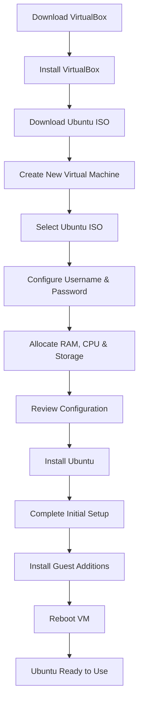

# 🐧 Installing Linux Using VirtualBox

## 📌 Overview
This project demonstrates how to install **Ubuntu Linux** on a **Virtual Machine** using **Oracle VirtualBox**. Running Linux inside a VM allows you to explore and test Linux without affecting your primary operating system.

---

## 🛠️ Prerequisites

- Windows/macOS/Linux host system
- Oracle VirtualBox installed
- Ubuntu ISO image (24.04 LTS or later)
- Minimum:
  - 4 GB RAM (8 GB recommended)
  - 20 GB free disk space
  - Virtualization enabled (Intel VT-x / AMD-V)

---

## 🚀 Installation Steps

### 1. Install Oracle VirtualBox
- Download VirtualBox from the official website.
- Install using the default settings.
- Launch VirtualBox after installation.

### 2. Download Ubuntu ISO
- Download the latest Ubuntu LTS ISO.
- Save it to your local system.

### 3. Create a New Virtual Machine
- Click **New**.
- Enter:
  - VM Name
  - OS Type: Linux
  - Version: Ubuntu (64-bit)
- Select the downloaded Ubuntu ISO.

### 4. Configure User Details
- Create:
  - Username
  - Password
  - Hostname

### 5. Allocate Resources
- Assign memory (recommended: 4–8 GB RAM).
- Allocate CPU cores based on your system.
- Create a virtual hard disk (minimum 20 GB).

### 6. Start Installation
- Review the VM configuration.
- Click **Finish**.
- Ubuntu installation starts automatically.

### 7. Complete Ubuntu Setup
- Set user password.
- Configure privacy and personalization settings.
- Finish the installation.

### 8. Install VirtualBox Guest Additions
Update packages:

```bash
sudo apt update
```

Install required dependencies:

```bash
sudo apt install -y build-essential linux-headers-$(uname -r)
```

Insert Guest Additions:

```
Devices → Insert Guest Additions CD Image
```

Run:

```bash
sudo ./VBoxLinuxAdditions.run
```

Reboot:

```bash
sudo reboot
```

---

## 📊 Installation Workflow



---

## ✅ Benefits of Using a Virtual Machine

- Safe environment for learning Linux.
- No changes to the host operating system.
- Supports multiple operating systems simultaneously.
- Easy testing and software experimentation.
- Snapshot and restore functionality.
- Portable virtual machines.
- Better resource utilization.
- Simplified backup and disaster recovery.
- Cost-effective compared to multiple physical machines.

---

## 📂 Technologies Used

- Oracle VirtualBox
- Ubuntu Linux
- Virtualization Technology

---

## 🎯 Outcome

After completing the setup, you will have a fully functional Ubuntu Linux virtual machine with:

- Full-screen support
- Shared clipboard
- Better display resolution
- Isolated development environment
- Safe testing platform
