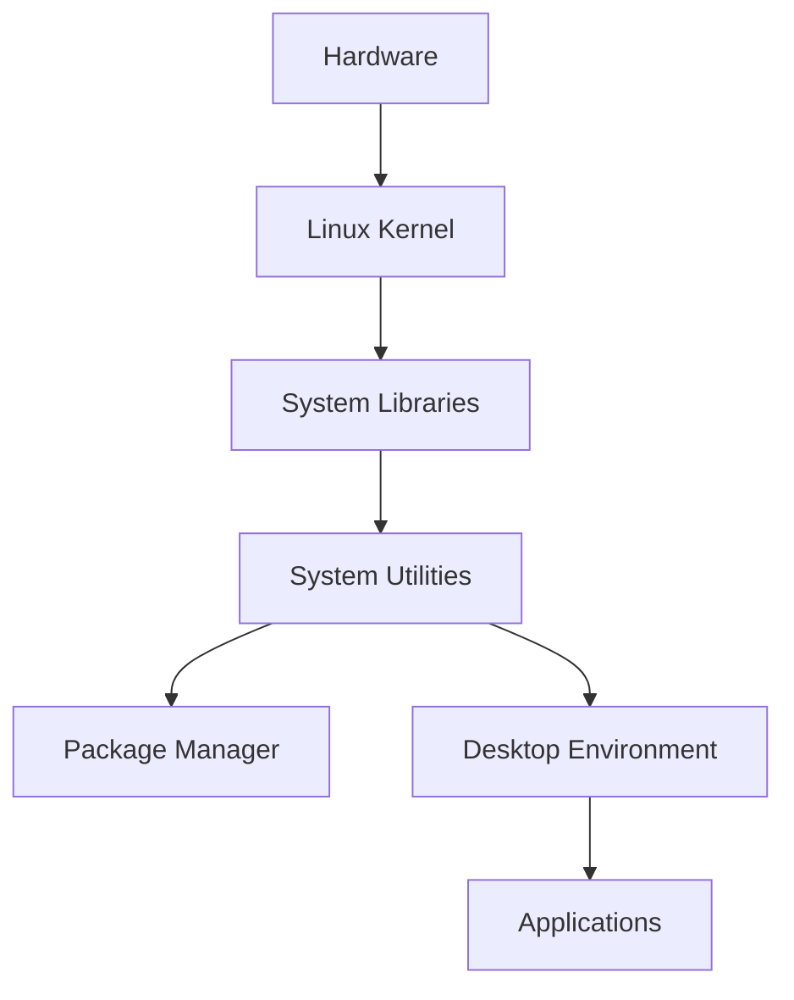
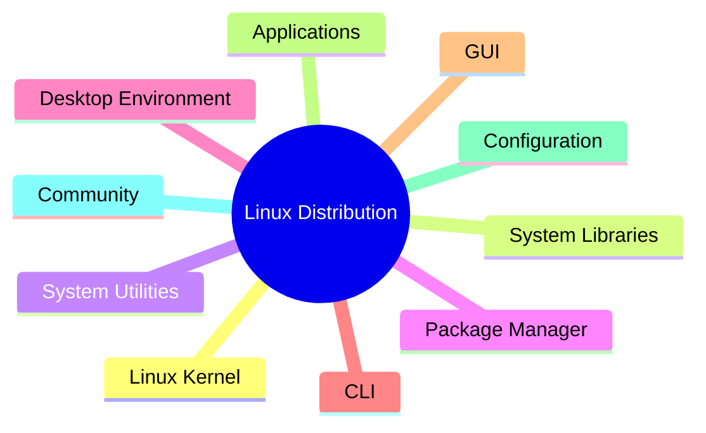
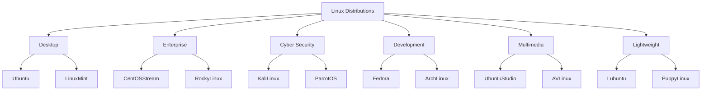
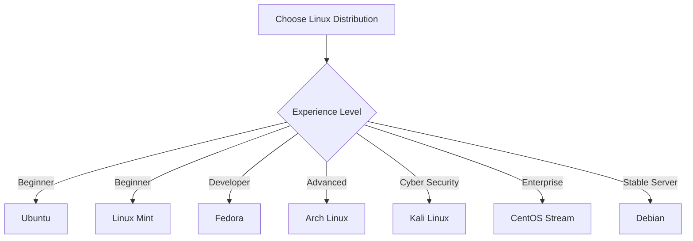
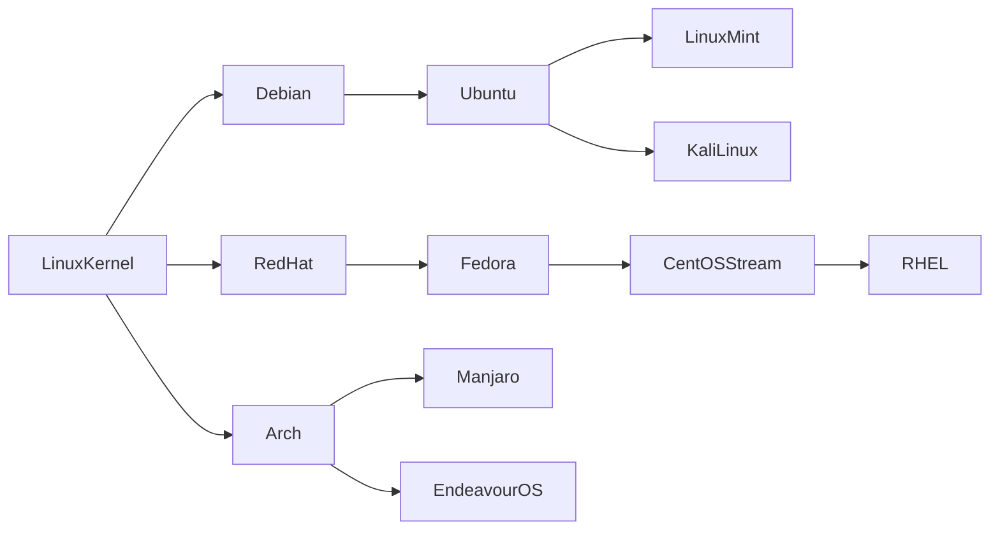

# 🐧 Linux Distributions

A **Linux Distribution (Linux Distro)** is an operating system built on the **Linux Kernel** and bundled with essential software, package managers, system utilities, and desktop environments. Different distributions are designed for various use cases such as desktop computing, software development, enterprise servers, and cybersecurity.

---

# 📖 Table of Contents

- [What is a Linux Distribution?](#-what-is-a-linux-distribution)
- [Architecture](#-architecture)
- [Popular Linux Distributions](#-popular-linux-distributions)
- [Components of a Linux Distribution](#-components-of-a-linux-distribution)
- [Linux Distribution Categories](#-linux-distribution-categories)
- [Benefits](#-benefits-of-linux-distributions)
- [Choosing the Right Distribution](#-choosing-the-right-linux-distribution)
- [Selection Guide](#-selection-guide)
- [Key Takeaways](#-key-takeaways)

---

# 📌 What is a Linux Distribution?

A Linux Distribution consists of:

- 🐧 Linux Kernel
- 📚 System Libraries
- ⚙️ System Utilities
- 📦 Package Manager
- 🖥 Desktop Environment (Optional)
- 🚀 Pre-installed Applications

---

# 🏗 Architecture

---

# 🌍 Popular Linux Distributions

| Distribution | Best For | Package Manager | Key Features |
|--------------|----------|-----------------|--------------|
| Ubuntu | Beginners, Desktop, Server | APT | Easy to use, LTS releases, Large community |
| Kali Linux | Cybersecurity | APT | 600+ security tools, Penetration testing |
| Debian | Stable Systems | APT | Reliable, Secure, Stable |
| Fedora | Developers | DNF | Latest technologies, Red Hat backed |
| Arch Linux | Advanced Users | Pacman | Minimal, Highly customizable |
| CentOS Stream | Enterprise Development | DNF | Continuous delivery, RHEL upstream |
| Linux Mint | Windows Users | APT | User-friendly, Ready to use |

---

# 🧩 Components of a Linux Distribution

## 1️⃣ Linux Kernel

- Core of the operating system
- Manages hardware resources
- Memory management
- Process scheduling
- Device drivers

---

## 2️⃣ System Libraries

- Provides APIs for applications
- Enables communication between applications and kernel
- Example: glibc

---

## 3️⃣ User Interface

### GUI (Graphical User Interface)

- GNOME
- KDE Plasma
- XFCE
- Cinnamon

### CLI (Command Line Interface)

- Bash
- Zsh
- Fish

---

## 4️⃣ Software Packages

Examples include:

- LibreOffice
- Firefox
- Chromium
- VLC Media Player
- Visual Studio Code
- GCC Compiler

---

## 5️⃣ Package Management

| Distribution | Package Manager |
|--------------|----------------|
| Ubuntu / Debian | APT |
| Fedora / CentOS Stream | DNF |
| Arch Linux | Pacman |

---

## 6️⃣ Configuration & Customization

- User Accounts
- Network Settings
- Security Policies
- Themes
- Desktop Environments

---

## 7️⃣ Community Support

- Documentation
- Forums
- GitHub
- Stack Overflow
- Community Contributions

---

# 🎯 Linux Distribution Categories

---

# ✅ Benefits of Linux Distributions

- 💰 Free and Open Source
- 🔒 Highly Secure
- ⚡ Lightweight and Fast
- 🎨 Fully Customizable
- 💻 Excellent for Software Development
- ☁️ Widely Used in Cloud Computing
- 🏢 Enterprise Ready
- 🔄 Regular Updates
- 🌍 Large Community Support
- 📦 Easy Software Installation

---

# 🎯 Choosing the Right Linux Distribution

---

# 📊 Selection Guide

| Requirement | Recommended Distribution |
|-------------|--------------------------|
| Beginner | Ubuntu |
| Windows Users | Linux Mint |
| Cybersecurity | Kali Linux |
| Stable Server | Debian |
| Developers | Fedora |
| Advanced Users | Arch Linux |
| Enterprise | CentOS Stream |
| Low-End Hardware | Lubuntu, Puppy Linux |

---

# 📈 Linux Distribution Ecosystem

---

# 🚀 Key Takeaways

- Linux distributions are operating systems built on the Linux Kernel.
- Each distribution targets a specific audience and use case.
- Package managers simplify software installation and updates.
- Popular desktop environments include GNOME, KDE Plasma, XFCE, and Cinnamon.
- Linux is secure, customizable, stable, and ideal for desktops, servers, cloud, development, and cybersecurity.
- Choose a distribution based on your experience, hardware, and intended use.

---

# 📚 References

- Ubuntu
- Debian
- Fedora
- Arch Linux
- Kali Linux
- CentOS Stream
- Linux Mint

---

## ⭐ If you found this repository useful, consider giving it a star!
