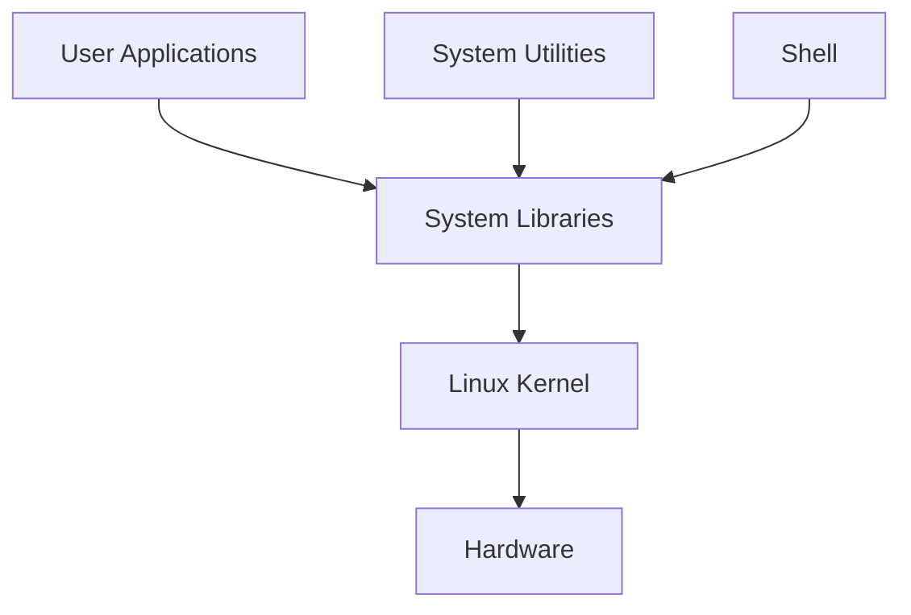

# 🐧 Introduction to Linux

## 📌 What is Linux?

Linux is a free and open-source operating system based on UNIX. It is known for its security, stability, flexibility, and wide use across servers, desktops, cloud computing, embedded systems, and supercomputers.

### Key Features
- 🔓 Free and Open Source
- 🔒 Secure and Stable
- ⚡ High Performance
- 🎯 Highly Customizable
- 👥 Multi-user & Multitasking
- 🌍 Large Global Community Support
- 💻 Supports Multiple Hardware Platforms

---

# 🗂️ Popular Linux Distributions

| Distribution | Primary Use |
|--------------|-------------|
| Ubuntu | Beginners, Desktop, Cloud |
| Debian | Stable Servers |
| Fedora | Developers |
| Kali Linux | Ethical Hacking & Penetration Testing |
| Linux Mint | Windows Users & Beginners |
| Manjaro | Arch-based Desktop |
| MX Linux | Lightweight Systems |
| openSUSE | Enterprise & Development |
| Deepin | Beautiful Desktop UI |
| Solus | Modern Desktop Experience |

---

# 🏗️ Linux Architecture

### Components

- **Applications** – Software used by end users.
- **System Utilities** – Tools for managing and configuring the system.
- **Shell** – Command-line interface that executes user commands.
- **System Libraries** – APIs that allow applications to communicate with the kernel.
- **Kernel** – Core of Linux that manages hardware, memory, processes, and files.
- **Hardware** – Physical devices like CPU, RAM, Storage, and I/O.

---

# 🚀 Applications of Linux

- 🌐 Web Servers & Hosting
- ☁️ Cloud Computing
- 💻 Software Development
- 🔐 Cybersecurity & Penetration Testing
- 📱 Embedded Systems & IoT
- 🧮 Supercomputers
- 🎓 Education & Research
- 🖥️ Desktop Computing

---

# ⚙️ Installing Linux

1. Choose a Linux distribution (Ubuntu, Fedora, Linux Mint, etc.).
2. Download the ISO image.
3. Create a bootable USB drive.
4. Boot the computer using the USB.
5. Follow the installation wizard.
6. Configure language, disk, and user account.
7. Restart the system.
8. Install software using package managers (`apt`, `dnf`, `pacman`, etc.).

---

# ✅ Advantages of Linux

- Open-source and free to use
- Excellent security and stability
- Fast and lightweight
- Supports multiple users simultaneously
- Powerful command-line interface
- Large software repository
- Ideal for servers, cloud, and development

---

# 📚 Summary

Linux is a reliable, secure, and highly customizable operating system used across desktops, servers, cloud platforms, embedded devices, and supercomputers. Its open-source nature and strong community support make it one of the most popular operating systems worldwide.
