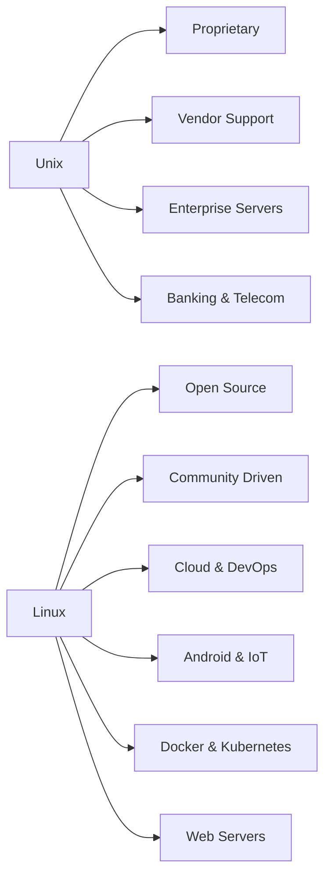

# Unix vs Linux

> A concise comparison of **Unix** and **Linux**, their differences, applications, and current industry trends.

---

## 📖 Overview

### Unix
- Developed in **1969** at **AT&T Bell Labs**
- Proprietary operating system
- Designed for **multi-user** and **multitasking**
- Known for **stability**, **security**, and **enterprise-grade reliability**
- Primarily used in enterprise servers and mission-critical systems

### Linux
- Developed in **1991** by **Linus Torvalds**
- Open-source operating system (GPL License)
- Community-driven development
- Highly customizable and portable
- Used in servers, desktops, cloud computing, embedded systems, and mobile devices

---

# Unix vs Linux Architecture

```text
                     Operating System
                           │
              ┌────────────┴────────────┐
              │                         │
          UNIX OS                  Linux OS
              │                         │
     Proprietary Kernel         Open Source Kernel
              │                         │
      Vendor Development      Community Development
              │                         │
        Enterprise Systems     Servers • Cloud • Desktop
              │                         │
      Telecom • Banking      Android • Docker • Kubernetes
```

---

# Linux vs Unix Comparison

| Feature | Linux | Unix |
|---------|--------|-------|
| **Origin** | 1991 (Linus Torvalds) | 1969 (AT&T Bell Labs) |
| **License** | Open Source (GPL) | Proprietary |
| **Development** | Community Driven | Vendor Driven |
| **Kernel** | Monolithic (Modular) | Traditional Monolithic |
| **Architecture Support** | x86, ARM, RISC-V, PowerPC, etc. | SPARC, PA-RISC, Itanium |
| **Default Shell** | Bash | Bourne Shell (sh), Korn Shell (ksh) |
| **File Systems** | Ext4, XFS, Btrfs, ZFS | UFS, JFS, ZFS, HFS |
| **GUI** | GNOME, KDE, XFCE | Limited (CDE) |
| **Hardware Support** | Wide range of devices | Enterprise hardware |

---

# Linux Applications

- ☁️ Cloud Computing (AWS, Azure, Google Cloud)
- 🌐 Web Servers (Apache, Nginx)
- 🐳 Docker & Kubernetes
- 📱 Android Operating System
- 🔐 Cybersecurity (Kali Linux)
- 📺 Smart TVs & IoT Devices
- 🚗 Automotive Systems
- 🖥️ Desktop Operating Systems
- 🧪 Scientific Computing
- 🚀 Supercomputers

---

# Unix Applications

- 🏦 Banking Systems
- 📈 Stock Exchange Platforms
- 📞 Telecommunications
- 🖥️ Enterprise Servers
- 🔒 Mission-Critical Applications
- 🧪 Scientific Research
- 🏛️ Government Infrastructure
- 💾 Legacy Enterprise Systems

---

# Industry Trends (2025–2026)

## Unix

- Still powers many **mission-critical enterprise systems**
- Common in:
  - Banking
  - Telecommunications
  - Mainframes
  - Scientific research
- Preferred where **stability**, **vendor support**, and **legacy compliance** are essential
- Expected to decline gradually as organizations modernize

---

## Linux

- Dominates modern infrastructure
- Default operating system for:
  - Cloud platforms
  - DevOps pipelines
  - Containers (Docker & Kubernetes)
  - Web hosting
  - Android devices
  - Embedded and IoT systems
- Powers **90%+ of leading web servers**
- Continues rapid growth due to flexibility and open-source ecosystem

---

# Visual Comparison



---

# Key Differences

- **Unix** is proprietary, while **Linux** is open source.
- **Unix** is maintained by vendors; **Linux** is developed by a global community.
- **Linux** supports a much wider range of hardware platforms.
- **Unix** is mainly used in enterprise and legacy environments.
- **Linux** dominates cloud computing, containers, embedded systems, and web servers.
- **Linux** offers greater customization and flexibility.
- **Unix** emphasizes long-term stability and certified vendor support.

---

# Summary

| Unix | Linux |
|------|-------|
| Proprietary | Open Source |
| Vendor Controlled | Community Driven |
| Enterprise Focus | General Purpose |
| Limited Hardware Support | Broad Hardware Support |
| High Stability | Highly Flexible |
| Legacy Infrastructure | Cloud, DevOps, Containers, Android |

---

## Conclusion

- Choose **Unix** for legacy enterprise environments that require certified vendor support, high reliability, and long-term stability.
- Choose **Linux** for modern infrastructure, cloud computing, DevOps, embedded systems, web hosting, and open-source development due to its flexibility, scalability, and extensive ecosystem.
